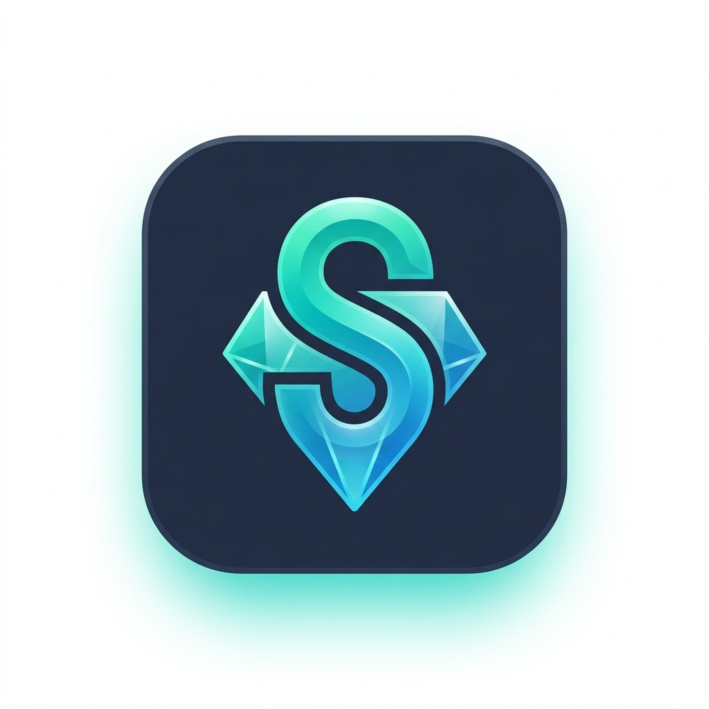

<div align="center">



# StonMaster

### Your All-in-One TON DeFi Command Center

**Sweep wallet dust. Maximize staking yields. Share viral trade strategies.**  
Built natively on STON.fi Omniston for the TON ecosystem.

[](https://ston-master.vercel.app)
[](https://ton.org)
[](https://ston.fi)
[](https://www.typescriptlang.org/)

</div>

---

## One-Liner

> **StonMaster turns your TON wallet into a high-performance DeFi workstation** - scan and sweep dust tokens, earn liquid staking yields, and share trade strategies that followers can execute with one tap.

---

## Short Description

Most TON wallet holders face three silent problems:

1. **Wallet clutter** - small "dust" token balances accumulate but cost more gas to sell than they're worth
2. **Idle capital** - TON sitting in wallets earns nothing when it could be liquid-staked
3. **Strategy silos** - profitable trade ideas live in heads or Telegram chats, never executed by others

StonMaster solves all three in one unified, premium-quality dashboard. It is the first **utility hub** built on top of the STON.fi Omniston protocol - combining autonomous dust sweeping, one-click liquid staking, and viral onchain strategy sharing into a single, production-ready web application.

---

## Core Modules

### StonSweep - Wallet Dust Cleaner
Automatically scans your wallet for low-value ("dust") token balances. Batches them into a single multi-swap transaction routed through **Omniston** for the best available price, converting everything back to native TON. No manual searching, no guesswork.

**Key features:**
- Real-time dust detection with USD value thresholds
- Auto-selection of all dust tokens on load
- Per-token step progress (quoting - building - signing - confirming)
- Multi-batch support for wallets with 10+ dust tokens
- Force-refresh with cache-busting to always show current balances
- TonViewer explorer link per batch transaction

### Yield Maximizer - Liquid Staking
One-click TON staking through the **Tonstakers** protocol. Receive liquid `tsTON` tokens that grow in value as staking rewards accumulate - no lock-up, no waiting.

**Key features:**
- Live APY, TVL, active staker count from Tonstakers API
- Both stake and instant-unstake flows
- Robust SDK initialization with 6-retry resilience (handles slow blockchain RPC)
- Real exchange rate: `1 tsTON = X TON` shown before confirmation
- Post-transaction explorer links

### SocialSwap - Viral Trade Strategies
Create a trade strategy (token pair + amount), generate a short shareable link powered by **Supabase**, and let followers execute the exact same swap with one tap. A first-of-its-kind social trading layer on TON.

**Key features:**
- Any-to-any token swap strategy creation
- Short link generation with persistent Supabase storage
- Followers see live-quoted estimated output before execution
- Unverified token warnings with onchain verification status
- Copy-to-clipboard + Telegram share integration

### Advanced Swap - Pro Swap Interface
A full-featured swap card powered directly by the Omniston SDK. Real-time quote streaming, adjustable slippage, wallet balance display for both "you pay" and "you receive" tokens, and automatic surfacing of all wallet-held tokens.

**Key features:**
- Live RFQ (Request for Quote) streaming via `useRfq` hook
- Wallet token auto-population in the token dropdown (no manual searching)
- "You Receive" panel shows current wallet balance of the target token
- Balance loading skeletons (no phantom `0.00` flash on mount)
- Slippage customization (0.5% / 1% / 3% / custom)
- Expandable quote details: min received, exchange rate, route
- Background transaction polling - TonViewer link appears automatically

---

## AI Tools Used

| Tool | Role |
|---|---|
| **Antigravity (Google DeepMind)** | Full-stack code generation, architecture design, bug resolution, performance optimization, and iterative UX refinement throughout the entire build |
| **Omniston AI Routing** | STON.fi's AI-powered liquidity routing engine that finds the best swap path across all TON DEXes in real-time |

> StonMaster was built with **Antigravity** as the primary AI coding partner - handling everything from initial scaffolding to production-level edge cases, TypeScript strictness, caching strategies, and design system implementation.

---

## Integrations

| Integration | Purpose |
|---|---|
| **STON.fi Omniston SDK** (`@ston-fi/omniston-sdk-react`) | Real-time swap quote streaming (RFQ), transaction building, settlement across all TON liquidity |
| **STON.fi Asset API** (`/v1/assets`) | Full token list with logos, verification status, and metadata |
| **TonConnect UI** (`@tonconnect/ui-react`) | Non-custodial wallet connection (Tonkeeper, MyTonWallet, and 50+ wallets) |
| **Tonstakers API** | Liquid staking: stake, unstake, live APY, TVL, rates, and staker count |
| **TonAPI** | Wallet jetton balances, native TON balance, USD pricing, and transaction polling |
| **Supabase** | Strategy short-link persistence for SocialSwap (PostgreSQL + REST API) |
| **TonViewer** | Transaction explorer links displayed post-confirmation |

---

## Technical Architecture

```
StonMaster/
├── src/
│   ├── components/
│   │   ├── common/
│   │   │   ├── AppIcon.tsx        # Centralized SVG icon system (20+ icons)
│   │   │   ├── TokenIcon.tsx      # Token image with gradient fallback
│   │   │   ├── GlassCard.tsx      # Neumorphic card container
│   │   │   └── GlassModal.tsx     # Portal-rendered modal system
│   │   ├── Dashboard/             # Portfolio overview + module cards
│   │   └── Layout/                # Sidebar navigation + header
│   ├── hooks/
│   │   ├── useTonBalance.ts       # Fast native TON balance (single call)
│   │   ├── useJettonBalances.ts   # Jetton balances with forceRefresh
│   │   ├── useTonstakers.ts       # Staking SDK with 6x retry resilience
│   │   └── useWallet.ts           # TonConnect wallet state
│   ├── modules/
│   │   ├── AdvancedSwap/          # Pro swap with Omniston RFQ
│   │   ├── Sweep/                 # Multi-token dust sweeper
│   │   ├── Earn/                  # Tonstakers liquid staking
│   │   └── Share/                 # SocialSwap strategy sharing
│   ├── services/
│   │   ├── tonapi.ts              # TonAPI client with request cache + invalidation
│   │   └── supabase.ts            # Short link CRUD
│   └── utils/
│       ├── constants.ts           # Default tokens, addresses
│       ├── formatters.ts          # TON/USD/amount formatting
│       └── tonExplorer.ts         # Tx polling + TonViewer URL builder
```

### Key Engineering Decisions

**Cache Invalidation Strategy**  
The `tonapi.ts` request cache uses a 5-second TTL to prevent hammering the API. User-initiated refreshes call `invalidateBalanceCache(address)` first, guaranteeing a fresh network hit - fixing the "click refresh 10 times" problem common in TON dApps.

**Two-Phase Success Modals**  
After any swap/stake transaction, a success modal appears immediately (great UX). A background `pollForNewTx` loop then finds the transaction hash and updates the modal with a TonViewer link - no blocking the UI.

**SDK Resilience**  
The Tonstakers SDK can take 5-12 seconds to complete its internal blockchain handshake. StonMaster implements `withSdkRetry` (6 attempts x 2s gaps) so stake/unstake operations succeed even when the SDK initializes slowly.

**Wallet Token Auto-Population**  
Both the Advanced Swap and SocialSwap token dropdowns automatically prepend all tokens held in the connected wallet to the "Popular" section - users never have to search for tokens they already own.

---

## Design System

StonMaster is built on a custom **neumorphic design system** - a premium soft-UI aesthetic that feels at home in the TON ecosystem.

- **Theme**: Soft light-mode neumorphism with extruded/inset depth shadows
- **Accent palette**: Teal - Cyan - Indigo gradient (`hsl(165-200)`)
- **Typography**: Inter (UI) + Outfit (Display headings)
- **Icons**: Custom `AppIcon` system - 20+ Feather-style SVG icons, zero OS emoji
- **Animations**: Framer Motion micro-animations on every state change
- **Components**: GlassCard, GlassModal, AnimatedNumber, LoadingSkeleton, TokenIcon

---

## Getting Started

### Prerequisites
- Node.js 18+
- A TON wallet (Tonkeeper recommended)
- STON.fi Omniston API access

### Installation

```bash
git clone https://github.com/mrnetwork0001/StonMaster.git
cd StonMaster
npm install
```

### Environment Variables

Create a `.env` file in the root:

```env
VITE_TONAPI_KEY=your_tonapi_key_here
VITE_SUPABASE_URL=your_supabase_project_url
VITE_SUPABASE_ANON_KEY=your_supabase_anon_key
VITE_MANIFEST_URL=https://your-domain.com/tonconnect-manifest.json
```

> Get a free TonAPI key at [tonconsole.com](https://tonconsole.com)  
> Get Supabase credentials at [supabase.com](https://supabase.com)

### Supabase Setup

Run this SQL in your Supabase project:

```sql
create table short_links (
  id        text primary key,
  strategy  jsonb not null,
  created_at timestamptz default now()
);
```

### Running Locally

```bash
npm run dev
```

Open [http://localhost:5173](http://localhost:5173)

---

## Tech Stack

| Layer | Technology |
|---|---|
| Framework | React 18 + Vite |
| Language | TypeScript 5 (strict) |
| Styling | Vanilla CSS (custom neumorphic design system) |
| Animations | Framer Motion |
| State | React hooks + @tanstack/react-query |
| Wallet | TonConnect UI React |
| Swap Protocol | STON.fi Omniston SDK |
| Staking | Tonstakers SDK |
| Database | Supabase (PostgreSQL) |
| Blockchain Data | TonAPI |
| Routing | React Router v6 |

---

## Why StonMaster Should Win

### Real Utility, Not a Demo
Every module performs actual onchain operations - real swaps, real staking, real transactions. No mock data, no simulated flows.

### Production-Grade Engineering
- Zero TypeScript errors across the entire codebase
- Request caching with user-controlled invalidation
- Retry logic for flaky blockchain RPC connections
- Error states and loading skeletons on every async surface

### Deep STON.fi Integration
StonMaster is one of the most comprehensive consumer applications built on Omniston - using the SDK for RFQ streaming, transaction building, and settlement across SweepPage, AdvancedSwap, and SocialSwap simultaneously.

### Novel Primitive: SocialSwap
The strategy-sharing feature is genuinely new to the TON ecosystem. Viral trade links that execute real onchain swaps represent a new distribution channel for DeFi activity - users become liquidity ambassadors.

### Premium UX at Hackathon Speed
The neumorphic design system, micro-animations, two-phase transaction modals, and zero-emoji icon system result in an application that feels like a funded product, not a weekend hack.

### Composable Architecture
Each module (Sweep, Earn, Share, Swap) is independently functional and can be extracted as a standalone SDK/widget. The shared `useJettonBalances`, `useTonBalance`, and `AppIcon` systems make the codebase extensible.

---

## Screenshots

> *Connect your wallet at [ston-master.vercel.app](https://ston-master.vercel.app) for the full experience.*

---

## License

MIT 2025 StonMaster - Built for the STON.fi Hackathon

---

<div align="center">

**Built with love for the TON ecosystem**

[STON.fi](https://ston.fi) · [TON](https://ton.org) · [Omniston Docs](https://docs.ston.fi) · [Tonstakers](https://tonstakers.com)

</div>
